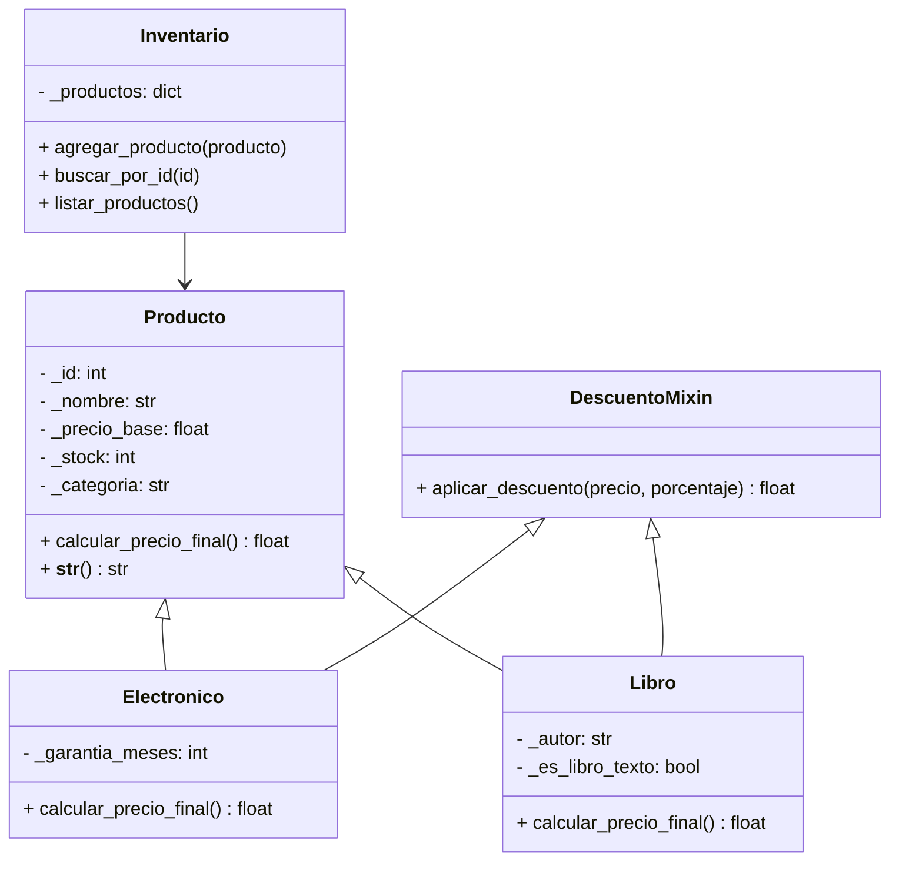

# Diagrama de clases

```mermaid
classDiagram
    class Producto {
        - _id: int
        - _nombre: str
        - _precio_base: float
        - _stock: int
        - _categoria: str
        + calcular_precio_final() float
        + __str__() str
    }
    class DescuentoMixin {
        + aplicar_descuento(precio, porcentaje) float
    }
    class Electronico {
        - _garantia_meses: int
        + calcular_precio_final() float
    }
    class Libro {
        - _autor: str
        - _es_libro_texto: bool
        + calcular_precio_final() float
    }
    class Inventario {
        - _productos: dict
        + agregar_producto(producto)
        + buscar_por_id(id)
        + listar_productos()
    }
    Producto <|-- Electronico
    Producto <|-- Libro
    DescuentoMixin <|-- Electronico
    DescuentoMixin <|-- Libro
    Inventario --> Producto
```
